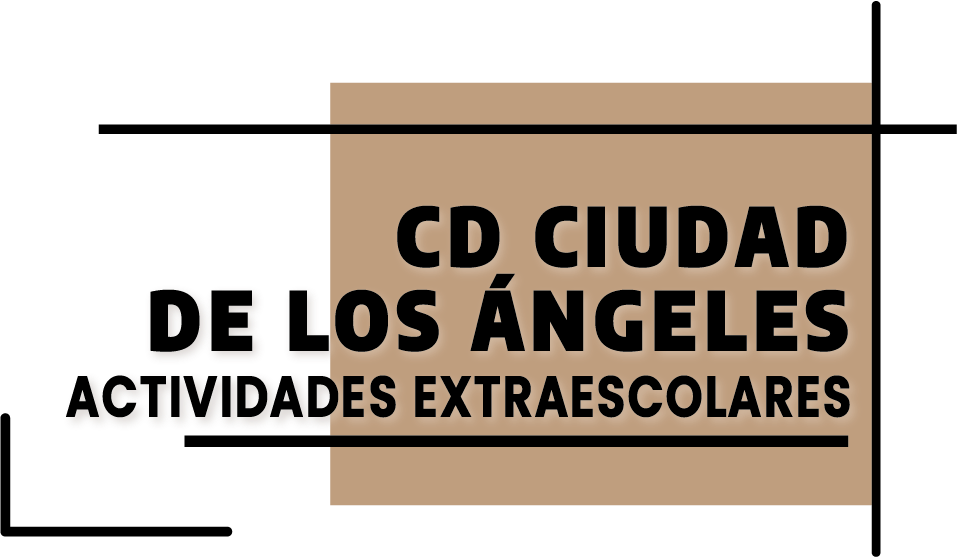

# Front Grupo Actividades Extraescolares

El *Grupo Actividades Extraescolares* presenta un proyecto innovador diseñado para ofrecer una plataforma web informativa sobre las actividades del Club Deportivo Ciudad de los Ángeles. Este proyecto también proporciona una solución integral para la gestión de asistencias, usuarios y actividades del club deportivo.

La página web se compone de varias secciones que detallan las diferentes actividades disponibles, además de un portal de acceso a la intranet para usuarios registrados. La estética de la web se basa en los colores del logo del Grupo Actividades Extraescolares.

  

## Tabla de Contenidos

- [Instalación](#instalación)
- [Uso](#uso)
- [Desarrolladores](#desarrolladores)
- [Licencia](#licencia)

## Estado del Proyecto
El proyecto se encuentra en estado de producción con posibles cambios de mejoras y actualizaciones..

## Instalación 💻
 Al instalarse el proyecto en la consola se deben tener en cuenta las siguientes indicaciones:  
- Se debe instalar pnpm en el ordenador de manera global: npm install -g pnpm
- Se debe instalar Node.js en el ordenador: pnpm install
- Dentro de la carpeta debemos escribir en la terminal: pnpm run dev

## Uso

Teniendo en cuenta la anterior información se podría navegar por todas las páginas de manera libre, aunque la intranet está protegida y será necesaria unas credenciales para poder acceder.

## Créditos

### Desarrolladores:
- ShanShan Bu [Linkedin](https://www.linkedin.com/in/shanshan-bu/)
- Daniela Zapata Quintana [Linkedin](https://www.linkedin.com/in/danielazapataquintana/)
- Yessenia Martínez [Linkedin](https://www.linkedin.com/in/yessenia-miranda-martinez/)
- Jander Gomez [Linkedin](https://www.linkedin.com/in/jandergomezbarrueta/)
- Vidhya Nadarajan
 [Linkedin](https://www.linkedin.com/in/vidhya-nadarajan-06a340284/)

## Tecnologías utilizadas

 
 
 

## Metodologías Ágiles
- <a href="https://trello.com/invite/b/7vUFwRF3/ATTId577aeac3dc017cea2bd4976a4a253b8EED8DA35/proyecto-final"> Trello </a>   
- <a href="https://www.figma.com/design/jzLjPd7euVQiLo390r2LSm/Proyecto-Final---Actividades-Extraescolares?node-id=0-1&t=A50MNfyEznANaHcd-1"> Figma </a>  
- <a href="https://github.com/WEB-AMPA">GitHub</a>  
- <a href="https://ciudadangelescd.netlify.app/">Deploy</a>

## Licencia

Este proyecto está bajo la Licencia [CCO](LICENSE).

Las fuentes utilizadas en este proyecto estan sujetas a licencia SIL con Copyright &copy; 2014, Indian Type Foundry (info@indiantypefoundry.com)

## Auditoria de la página
Documento de la <a href="https://docs.google.com/document/d/1DCitY6bdP-OATygXNuJkQNOHDs2ysGejdwPJjzjWZ1s/edit?usp=sharing">Auditoria</a>